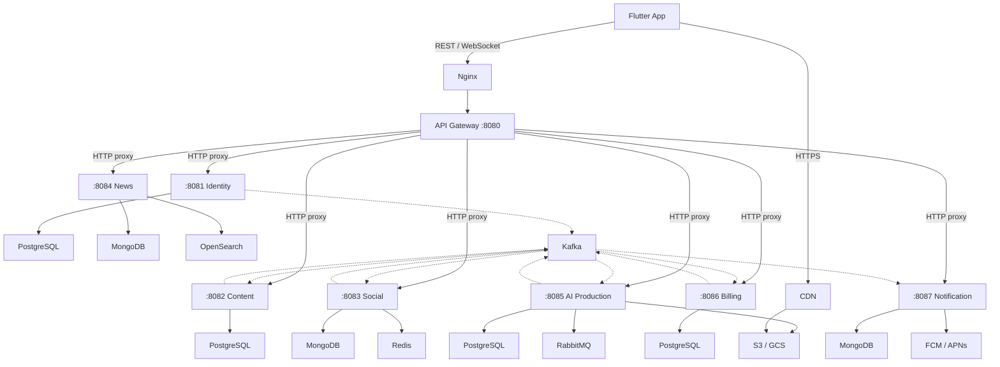

# Pody — Kiến Trúc Microservices

Tài liệu này là nguồn sự thật (source of truth) cho mọi quyết định kiến trúc của hệ thống Pody. Khi viết code, tạo service mới, hay sửa đổi hệ thống, **phải tuân thủ** các quy tắc dưới đây.

---

## Nguyên Tắc Bắt Buộc

1. **Mỗi service có vòng đời deploy riêng.** Không đặt code của 2 service trong cùng 1 binary.
2. **Mỗi service sở hữu database riêng.** Không JOIN, không foreign key xuyên service. Nếu cần dữ liệu từ service khác, dùng event bus hoặc API call.
3. **Đồng bộ dữ liệu qua Kafka event bus.** Không gọi API đồng bộ giữa các service trừ khi qua Gateway composition.
4. **File media (audio, ảnh, transcript) luôn lưu trong Object Storage (S3/GCS).** Database chỉ lưu URL trỏ đến file. Không dùng BYTEA hay BLOB.
5. **Xác thực tập trung tại API Gateway.** Services phía sau đọc headers `X-Auth-User-ID`, `X-Auth-Role`, `X-Auth-Email` mà Gateway đã enrich. Không verify JWT lại ở từng service.

---

## Sơ Đồ Tổng Quan

---

## Services — Trách Nhiệm, Stack và Quy Tắc

### API Gateway (`:8080`)

- **Stack:** Go + Chi (`net/http`).
- **Vai trò:** JWT verify, routing, HTTP reverse proxy, CORS, request ID, access log.
- **Không** chứa logic nghiệp vụ. Chỉ verify token, enrich headers, rồi proxy nguyên request sang service đích.
- Auth middleware: Parse `Authorization: Bearer <JWT>`, verify chữ ký HMAC-SHA256 bằng `JWT_SECRET`, set headers `X-Auth-User-ID` (từ claim `sub`), `X-Auth-Role`, `X-Auth-Email` vào request trước khi proxy.
- Các path cần skip auth được cấu hình trong `AUTH_EXCLUDED_PATHS` (mặc định: `/api/v1/identity/sign-in`, `/api/v1/identity/sign-up`, `/api/v1/identity/forgot-password`).
- Khi cần query composition (gom dữ liệu nhiều service cho 1 màn hình), Gateway gọi các service **song song** bằng goroutines. Nếu service phụ lỗi → trả giá trị mặc định, không block response.

### Identity Service (`:8081`)

- **Stack:** Go + Chi + PostgreSQL.
- **Vai trò:** Quản lý user, multi-provider authentication, session/device tracking.
- Database dùng 2 bảng chính: `users` (profile, email unique, `token_version`) và `auth_providers` (provider + provider_user_id, unique constraint). 1 user có thể liên kết nhiều providers (Google, Apple, Email, Phone).
- Khi tạo user mới, **phải** phát event `UserRegistered` lên Kafka.
- Khi ban user, **phải** phát event `UserBanned`.
- Khi user đổi profile, **phải** phát event `UserProfileUpdated` để các service khác cập nhật read model.
- JWT: Access Token (HS256, TTL 15–30 phút, chứa `sub`, `role`, `email`, `exp`, `iat`, `jti`). Refresh Token (opaque random string, lưu bảng `sessions`, TTL 30 ngày).
- Thu hồi token: Xóa refresh token (logout 1 thiết bị), JWT blacklist trong Redis bằng `jti` (logout tức thì), tăng `token_version` trong bảng `users` (logout tất cả thiết bị).
- Multi-provider login: Khi email trùng giữa provider mới và user đã có → auto-link nếu email verified cả 2 phía, ngược lại yêu cầu user xác nhận.
- Apple Sign-In: Apple chỉ gửi email/name ở lần đầu tiên. **Phải lưu ngay**, các lần sau chỉ có `sub`.

### Content Service (`:8082`)

- **Stack:** Go + Chi + PostgreSQL.
- **Vai trò:** Quản lý Show, Episode, Transcript, Companion content.
- Dùng PostgreSQL vì quan hệ cha-con chặt (Show → Episode → Transcript), cần Foreign Key + CASCADE DELETE.
- Database **chỉ lưu URL** của audio/ảnh/transcript. File thực tế nằm trên S3/GCS.
- Khi publish episode, **phải** phát event `EpisodePublished` lên Kafka.
- Khi nhận event `EpisodeGenerationCompleted` từ AI → tạo episode mới gắn `audio_url`.

### Social Service (`:8083`)

- **Stack:** TypeScript + Fastify + Mongoose + Redis.
- **Vai trò:** Follow, Reaction, Comment, Listening Progress, Playlist.
- Dùng MongoDB vì schema linh hoạt (reaction types thay đổi thường xuyên, comment có thể nhúng media) và write-heavy workload.
- Dùng Redis cho counters (like count, follower count, comment count) — **không** query `countDocuments()` mỗi lần hiển thị.
- Khi nhận event `UserRegistered` → tạo profile (0 follower, 0 following).
- Khi nhận event `UserProfileUpdated` → cập nhật read model (tên, avatar trong comments).
- Khi nhận event `UserBanned` → ẩn hoặc xóa comment/reaction của user.

### News Service (`:8084`)

- **Stack:** Python + FastAPI + Scrapy.
- **Vai trò:** Crawl tin tức, lưu trữ bài báo, search index.
- Dùng MongoDB vì dữ liệu crawl từ nhiều nguồn có cấu trúc khác nhau (schema linh hoạt).
- Dùng OpenSearch cho full-text search và vector search (embedding). Khi bài báo mới lưu vào MongoDB → đồng bộ sang OpenSearch để index.
- OpenSearch **không phải** database chính. MongoDB là source of truth. Nếu OpenSearch mất index → rebuild từ MongoDB.

### AI Production Service (`:8085`)

- **Stack:** Python + FastAPI + Celery.
- **Vai trò:** Chat AI, Plan, Draft, Generation Job (sinh audio, transcript).
- Dùng PostgreSQL cho job state machine (`pending → processing → completed → failed`) vì cần ACID tránh 2 worker nhặt cùng 1 job.
- Dùng RabbitMQ làm task queue: API nhận request → tạo job trong DB (pending) → đẩy message vào queue → trả response ngay. Worker nhặt job từ queue → xử lý → upload kết quả lên S3/GCS → cập nhật job thành completed.
- RabbitMQ vì cần ACK/NACK (tự requeue nếu worker sập), priority queue (premium user ưu tiên), delayed retry.
- Khi job hoàn thành, **phải** phát event `EpisodeGenerationCompleted` lên Kafka.

### Billing Service (`:8086`)

- **Stack:** Go + Chi + PostgreSQL.
- **Vai trò:** Subscription, Payment, Credit, Entitlement.
- Dùng PostgreSQL bắt buộc vì xử lý tiền cần ACID, Serializable isolation, audit trail. **Không bao giờ** dùng MongoDB cho billing.
- Dùng `int64` tính bằng đơn vị nhỏ nhất (xu/cent) để tránh lỗi floating point.
- Khi grant entitlement, **phải** phát event `EntitlementGranted` lên Kafka.
- Khi nhận event `UserRegistered` → tạo ví credit rỗng hoặc kích hoạt free trial.
- Khi nhận event `UserBanned` → hủy auto-renewal subscription.

### Notification Service (`:8087`)

- **Stack:** TypeScript + Fastify + Mongoose.
- **Vai trò:** In-app notification, push log, notification settings.
- Dùng MongoDB vì payload đa dạng theo loại thông báo (mỗi loại có cấu trúc riêng) và cần TTL Index tự dọn rác (thông báo cũ hơn 90 ngày tự xóa).
- Push notification qua FCM (Android) và APNs (iOS).
- Service này **chỉ consume** events từ Kafka, không publish.
- Events cần xử lý: `UserRegistered` (gửi chào mừng), `EpisodePublished` (push cho follower), `EpisodeGenerationCompleted` (thông báo hoàn tất), `UserBanned` (thông báo tài khoản bị khóa).

---

## Giao Thức Truyền Dữ Liệu

| Tầng | Giao thức | Quy tắc |
| --- | --- | --- |
| App ↔ Nginx | HTTPS (HTTP/2) | Nginx xử lý SSL termination. Mọi traffic public phải qua HTTPS. |
| Nginx ↔ Gateway | HTTP | Mạng nội bộ, không cần TLS. |
| App ↔ Gateway (API) | REST/JSON | Dùng cho tất cả CRUD operations. Mọi endpoint đặt dưới `/api/v1/{service}/`. |
| App ↔ Gateway (real-time) | WebSocket | Dùng cho push notification real-time, AI chat streaming. |
| Gateway ↔ Services | HTTP reverse proxy | Hiện tại proxy nguyên request. Tương lai có thể chuyển sang gRPC. |
| Service ↔ Kafka | Kafka Protocol | Event bus giữa các service. Message format JSON. |
| Service ↔ RabbitMQ | AMQP 0.9.1 | Task queue cho AI worker. |
| App ↔ S3/GCS | HTTPS qua CDN | Tải audio, ảnh, transcript. CDN phân phối gần user, hỗ trợ byte-range. |

---

## Message Queue — Quy Tắc Sử Dụng

### Kafka (Event Bus — Giao tiếp giữa các service)

- Dùng khi 1 service cần **thông báo sự kiện** cho nhiều service khác biết.
- Message được lưu trên disk, replay được. Mỗi service nhận bởi Consumer Group riêng.
- Events bắt buộc: `UserRegistered`, `UserProfileUpdated`, `UserBanned`, `EpisodePublished`, `EpisodeGenerationCompleted`, `EntitlementGranted`.
- Partition key = entity ID (userId, episodeId) để đảm bảo thứ tự events cho cùng 1 entity.

### RabbitMQ (Task Queue — Xếp hàng job AI)

- Dùng khi cần **phân phối job nặng** cho worker xử lý nền (sinh audio, tạo transcript).
- ACK/NACK: Worker sập → job tự requeue. Priority queue: Premium user xử lý trước.
- **Không** dùng Kafka làm task queue. **Không** dùng RabbitMQ làm event bus.

---

## Object Storage — Quy Tắc Lưu File

| Loại file | Lưu ở | DB lưu gì |
| --- | --- | --- |
| Audio (MP3/AAC, 30–50MB) | S3/GCS → CDN | `episodes.audio_url` |
| Ảnh bìa (WebP/JPEG) | S3/GCS → Image CDN (auto-resize) | `episodes.cover_url`, `shows.cover_url` |
| Transcript (JSON) | S3/GCS | `episodes.transcript_url` |

**Không bao giờ** lưu file binary vào PostgreSQL hay MongoDB.

---

## Query Composition (BFF Pattern)

Khi 1 màn hình App cần dữ liệu từ nhiều service, Gateway gọi song song rồi gom lại:

| Màn hình | Gọi service | Dữ liệu |
| --- | --- | --- |
| Home | Content + Social + Billing | Tập mới + counters + trạng thái VIP |
| Player | Content + Social + Billing | Episode + comments/reactions + access check |
| Profile | Identity + Social + Content | Profile + follow stats + authored shows |
| Create | AI + News + Billing | AI plans + news articles + credit availability |

Quy tắc: Nếu service phụ (Social, Billing) lỗi → trả giá trị mặc định. Service chính (Content) lỗi → trả 404/500.

---

## Nginx — Vai Trò

| Vai trò | Mô tả |
| --- | --- |
| Reverse Proxy | Giấu cấu trúc nội bộ, chỉ expose 1 domain `api.pody.com` |
| SSL Termination | HTTPS tập trung, services phía sau dùng HTTP thuần |
| Load Balancer | Phân tải cho nhiều instance Gateway |
| Rate Limiting | Chống DDoS/spam ở tầng hạ tầng |

---

## Service Port Mapping

| Service | Port | Env Variable |
| --- | --- | --- |
| API Gateway | 8080 | `PORT` |
| Identity | 8081 | `IDENTITY_SERVICE_URL` |
| Content | 8082 | `CONTENT_SERVICE_URL` |
| Social | 8083 | `SOCIAL_SERVICE_URL` |
| News | 8084 | `NEWS_SERVICE_URL` |
| AI Production | 8085 | `AI_SERVICE_URL` |
| Billing | 8086 | `BILLING_SERVICE_URL` |
| Notification | 8087 | `NOTIFICATION_SERVICE_URL` |

---

## Tài Liệu Liên Quan

- Thiết kế CSDL tổng thể: `database_schema.md`
- SQL cho service dùng PostgreSQL: `../server/sql/services/`
- Collection design cho service document store: `../server/schema/`
- API Gateway README: `../server/api-gateway/README.md`
- Identity Service README: `../server/identity-service/README.md`
