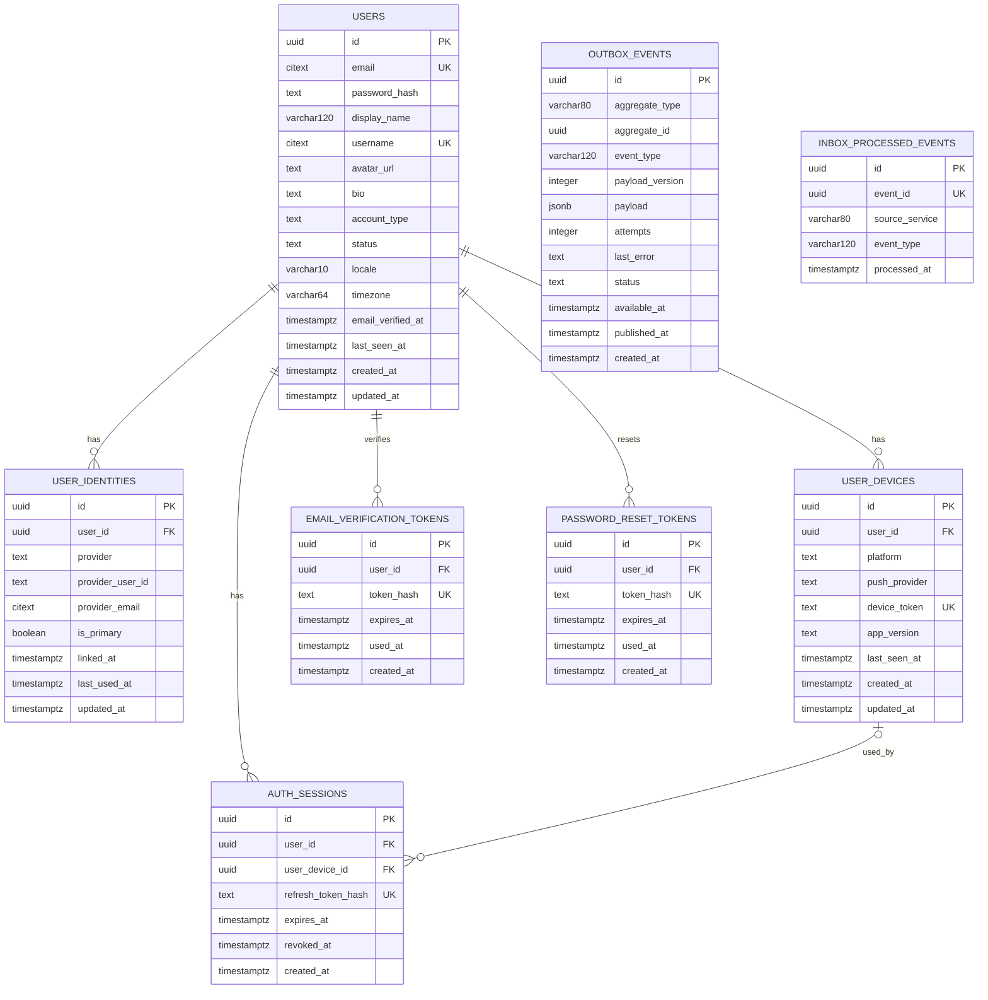
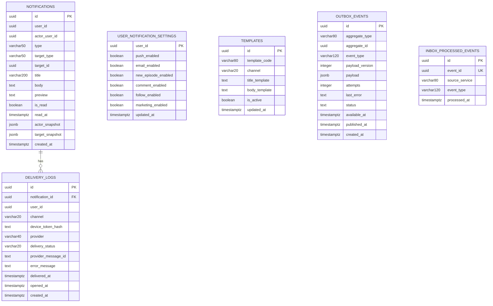
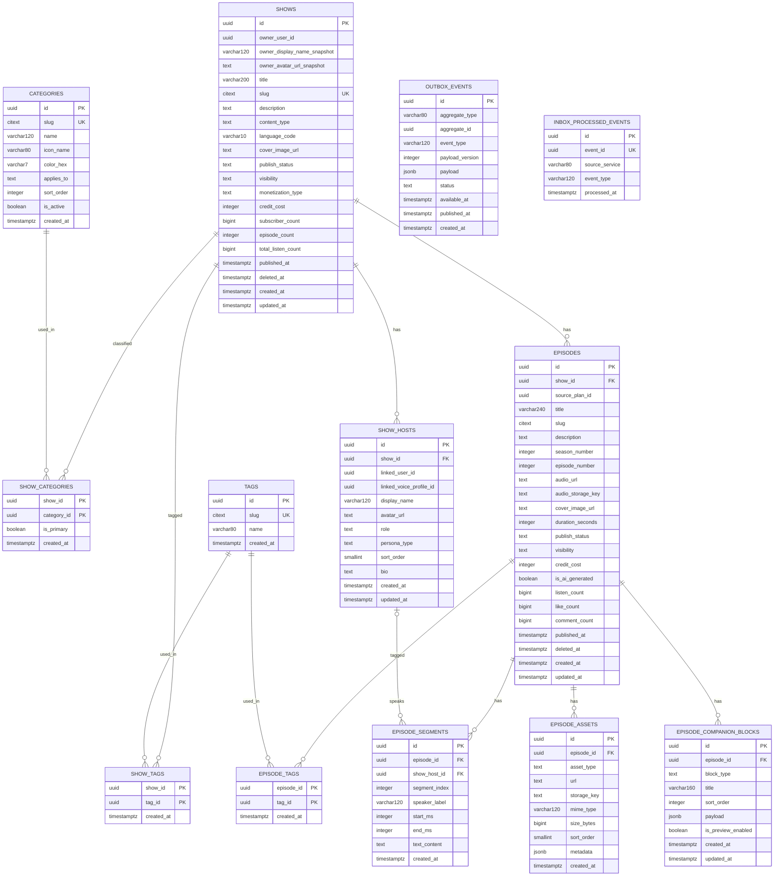
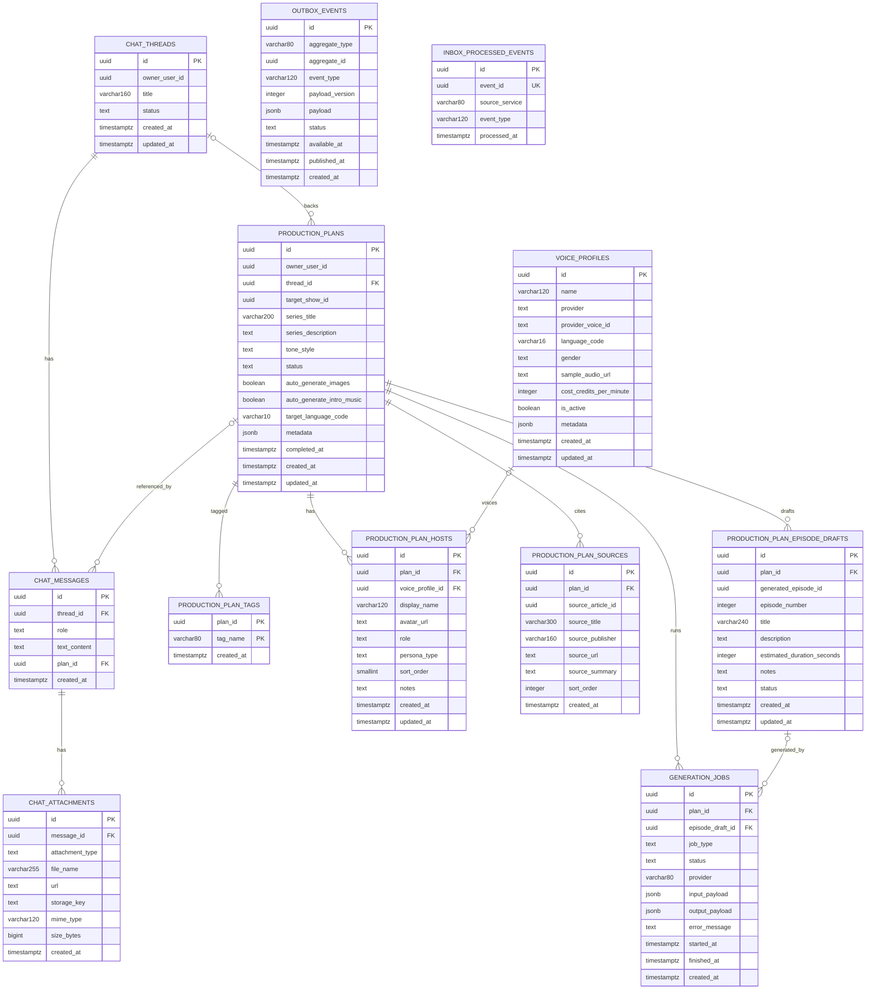
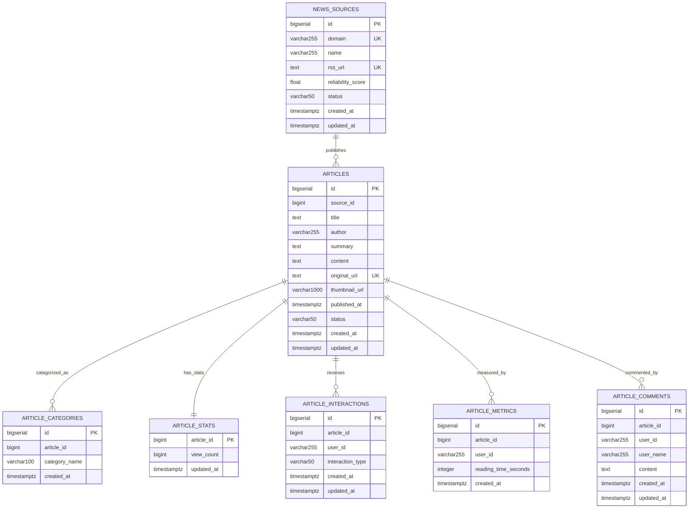
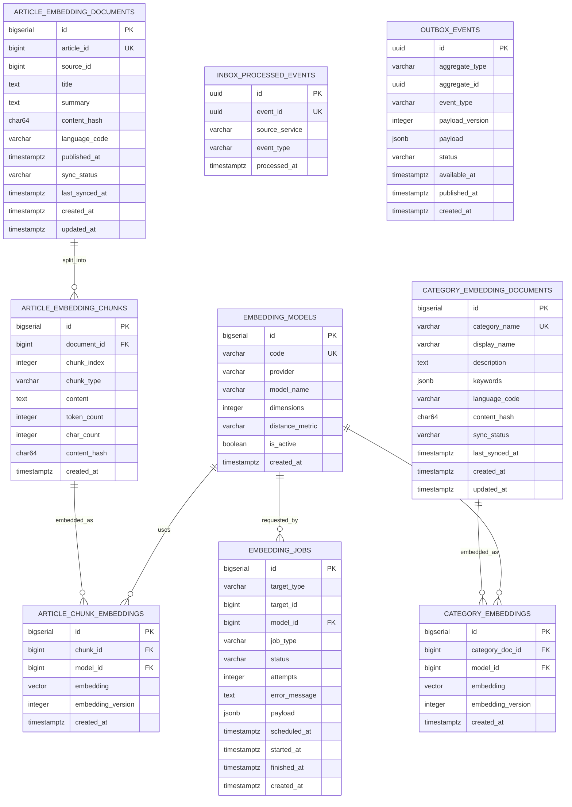

# Pody - Thiết Kế Cơ Sở Dữ Liệu Hệ Thống

Tài liệu này mô tả thiết kế cơ sở dữ liệu của hệ thống Pody để phục vụ viết báo cáo và đối chiếu với source code. Nội dung dưới đây ưu tiên bám theo trạng thái hiện tại của repo, cụ thể là:

- `docker-compose.yml`
- `server/migrations/run-migrations.sh`
- `server/sql/services/*.sql`
- `server/schema/social_service.md`

## 1. Tổng quan

Pody được thiết kế theo kiến trúc microservices, trong đó mỗi service sở hữu một database riêng. Cách tổ chức này giúp từng service có thể phát triển, migration và deploy độc lập, đồng thời giảm phụ thuộc trực tiếp giữa các module nghiệp vụ.

Về mặt lưu trữ, hệ thống hiện tại tập trung chủ yếu vào PostgreSQL cho các service có dữ liệu quan hệ rõ ràng như `identity`, `content`, `ai`, `article`, `notification`. Ngoài ra, repo còn có thiết kế cho `social-service` theo hướng document store và `embedding-service` theo hướng vector database trên nền PostgreSQL mở rộng.

Ba nguyên tắc quan trọng của tầng dữ liệu trong dự án:

1. Mỗi service sở hữu database riêng, không join và không tạo foreign key xuyên service.
2. Tham chiếu sang service khác chỉ được lưu dưới dạng external id.
3. Đồng bộ dữ liệu giữa các service thông qua event và cặp bảng `outbox_events` và `inbox_processed_events` để đảm bảo idempotency.

## 2. Bảng tổng hợp hệ thống lưu trữ

| Service | Kho lưu trữ chính | Trạng thái trong repo | Ghi chú |
| --- | --- | --- | --- |
| Identity Service | PostgreSQL | Đã migrate runtime | Quản lý user, identity provider, device, session |
| Notification Service | PostgreSQL | Đã migrate runtime | Lưu notification, settings, delivery logs |
| Content Service | PostgreSQL | Đã migrate runtime | Lưu show, episode, asset, transcript segment |
| AI Service | PostgreSQL | Đã migrate runtime | Lưu thread, plan, host, source, draft, generation job |
| Article Service | PostgreSQL | Đã migrate runtime | Lưu nguồn tin, bài báo, category, comment, metric |
| Embedding Service | PostgreSQL + pgvector đề xuất | Chưa có migration chính thức | Thiết kế bổ sung cho semantic search và prompt grounding |
| Billing Service | PostgreSQL | Có schema, chưa thấy wire vào runtime | Subscription, giao dịch, ví credit, entitlement |
| Social Service | MongoDB theo tài liệu thiết kế | Chưa thấy migration/runtime SQL | Follow, reaction, comment, playlist, listening progress |

## 3. Mô hình thiết kế chung

### 3.1 Database per service

Hệ thống áp dụng mô hình `database per service`, nghĩa là mỗi service được toàn quyền quản lý schema và dữ liệu của chính nó. Cách làm này đặc biệt phù hợp với microservices vì:

- giảm coupling giữa các service;
- cho phép migration độc lập;
- tránh lẫn logic nghiệp vụ giữa các domain;
- dễ xây dựng read model thông qua event-driven integration.

### 3.2 Outbox và inbox processed events

Nhiều service trong repo đều có hai bảng:

- `outbox_events`: lưu sự kiện cần phát ra ngoài service;
- `inbox_processed_events`: lưu danh sách event đã xử lý để tránh xử lý trùng khi consumer retry.

Đây là mẫu thiết kế quan trọng để đảm bảo:

- phát event ổn định hơn so với publish trực tiếp trong transaction nghiệp vụ;
- xử lý idempotent;
- dễ tích hợp với Kafka, Debezium hoặc các cơ chế CDC/event bus về sau.

### 3.3 Không lưu binary trong database

Trong hệ thống này, database chỉ lưu metadata hoặc URL trỏ đến file. Các tệp lớn như audio, ảnh, transcript không được lưu trực tiếp dưới dạng BLOB/BYTEA. Vì vậy:

- `content-service` chỉ lưu `audio_url`, `cover_image_url`, `storage_key`;
- `ai-service` và `embedding-service` chỉ lưu metadata phục vụ pipeline;
- object storage mới là nơi lưu file nguồn và file sinh ra.

## 4. Identity Service Database

Identity Service là trung tâm quản lý danh tính người dùng. Database của service này được thiết kế để hỗ trợ đăng nhập đa nhà cung cấp, theo dõi thiết bị, session, xác minh email và đặt lại mật khẩu.

Bảng trung tâm là `users`, nơi lưu thông tin profile cơ bản và trạng thái tài khoản. Từ đó, các bảng con như `user_identities`, `user_devices`, `auth_sessions`, `email_verification_tokens`, `password_reset_tokens` mở rộng các nghiệp vụ xác thực và bảo mật.

Điểm mạnh của schema này:

- hỗ trợ một user gắn nhiều provider login;
- hỗ trợ quản lý session theo từng device;
- dễ kiểm soát token reset và verification có hạn dùng;
- hỗ trợ eventing thông qua outbox/inbox.

## 5. Notification Service Database

Notification Service phụ trách lưu thông báo trong ứng dụng và nhật ký gửi thông báo qua các kênh như push hoặc email. Khác với bản mô tả kiến trúc cũ trong một số tài liệu, schema runtime hiện tại của service này đang nằm trên PostgreSQL.

Database gồm bốn nhóm dữ liệu chính:

- `user_notification_settings`: tùy chọn nhận thông báo của mỗi user;
- `notifications`: nội dung thông báo hiển thị trong app;
- `delivery_logs`: lịch sử gửi thông báo qua từng kênh;
- `templates`: mẫu thông báo dùng lại cho nhiều tình huống.

Thiết kế này cho phép tách rõ ba mức: cấu hình nhận thông báo, nội dung thông báo và log vận chuyển thông báo.

## 6. Content Service Database

Content Service là nơi quản lý toàn bộ nội dung cốt lõi của nền tảng, bao gồm show, host, episode và các thành phần bổ trợ cho episode. Đây là service có mô hình quan hệ rõ nhất trong hệ thống.

Hai trục quan hệ chính của database này là:

- trục catalog: `shows` - `episodes`;
- trục metadata: `categories`, `tags`, `assets`, `segments`, `companion blocks`.

Schema này phù hợp với các use case:

- một show có nhiều host, nhiều episode;
- một episode có thể có nhiều asset, nhiều segment transcript;
- category và tag được gắn theo quan hệ nhiều-nhiều;
- có thể mở rộng nội dung bổ trợ cho episode thông qua `episode_companion_blocks`.

## 7. AI Service Database

AI Service lưu toàn bộ quá trình lên kế hoạch và sinh nội dung bằng AI. Với service này, dữ liệu không chỉ mang tính nội dung mà còn là workflow, vì vậy có cấu trúc database vừa phục vụ lưu trữ hội thoại, vừa phục vụ quản lý tiến trình generation job.

Schema được tổ chức quanh các thực thể chính:

- `chat_threads` và `chat_messages`: lịch sử hội thoại;
- `production_plans`: đề án sản xuất nội dung;
- `production_plan_hosts`, `production_plan_sources`, `production_plan_episode_drafts`: các thành phần của một plan;
- `generation_jobs`: quản lý vòng đời job sinh nội dung.

Mô hình này phù hợp với bài toán AI production vì cần theo dõi chat context, plan state, draft state và execution state một cách nhất quán.

## 8. Article Service Database

Article Service là nơi lưu trữ và phục vụ dữ liệu bài báo, nguồn tin và các tương tác liên quan. Trong repo hiện tại, service này được xây dựng trên PostgreSQL, khác với mô tả `news-service` theo hướng document store trong tài liệu kiến trúc cũ.

Schema gồm các lớp dữ liệu:

- `news_sources`: danh mục nguồn tin;
- `articles`: bài báo gốc;
- `article_categories`: thể loại của bài báo;
- `article_stats`: thống kê lượt xem;
- `article_interactions`: like, love và các tương tác;
- `article_metrics`: số liệu về thời gian đọc;
- `article_comments`: bình luận cho bài báo.

Một điểm cần lưu ý là nhiều quan hệ trong service này hiện được thể hiện ở tầng ứng dụng và query repository, chứ không được ràng buộc bằng foreign key vật lý trong SQL migration.

## 9. Embedding Service Database

Embedding Service hiện chưa có migration chính thức trong repo, tuy nhiên đây là thành phần hợp lý để mở rộng `article-service` theo hướng semantic search, retrieval và prompt grounding. Về nguyên tắc, service này nên có database riêng, không chèn vector embedding trực tiếp vào database của `article-service`.

Thiết kế đề xuất gồm ba lớp:

- lớp cấu hình model embedding;
- lớp document và chunk để cắt nhỏ nội dung bài báo/thể loại;
- lớp vector embedding và job sinh embedding.

Lợi ích của thiết kế tách riêng:

- cho phép đổi model embedding mà không ảnh hưởng schema bài báo gốc;
- có thể sinh lại embedding theo từng phiên bản model;
- dễ bổ sung search vector trong PostgreSQL với `pgvector`.

## 10. Billing Service Database

Billing Service có schema khá đầy đủ trong repo, mặc dù hiện tại chưa thấy được đưa vào luồng migration runtime. Về mặt thiết kế, đây là database phục vụ thanh toán, subscription, credit và quyền truy cập nội dung.

Cấu trúc database gồm:

- `subscription_plans`: gói dịch vụ;
- `user_subscriptions`: đăng ký của từng user;
- `payment_transactions`: giao dịch thanh toán;
- `credit_ledger`: sổ cái biến động credit;
- `credit_reservations`: giữ chỗ credit trong quá trình xử lý;
- `content_entitlements`: quyền truy cập show hoặc episode.

Thiết kế này rất phù hợp cho domain billing vì nó tách rõ:

- nguồn gốc giao dịch;
- biến động số dư;
- quyền truy cập nội dung sau thanh toán.

```mermaid
erDiagram
    SUBSCRIPTION_PLANS ||--o{ USER_SUBSCRIPTIONS : selected_by
    USER_SUBSCRIPTIONS o|--o{ PAYMENT_TRANSACTIONS : billed_in
    CREDIT_LEDGER o|--o{ CONTENT_ENTITLEMENTS : grants

    SUBSCRIPTION_PLANS {
        uuid id PK
        citext code UK
        varchar120 name
        text billing_period
        numeric12_2 price_amount
        char3 currency
        integer monthly_credit_grant
        integer max_private_shows
        boolean is_active
        jsonb features
        timestamptz created_at
        timestamptz updated_at
    }

    USER_SUBSCRIPTIONS {
        uuid id PK
        uuid user_id
        uuid plan_id FK
        text provider
        text provider_customer_id
        text provider_subscription_id
        text status
        timestamptz started_at
        timestamptz current_period_start
        timestamptz current_period_end
        boolean cancel_at_period_end
        timestamptz ended_at
        timestamptz created_at
        timestamptz updated_at
    }

    PAYMENT_TRANSACTIONS {
        uuid id PK
        uuid user_id
        uuid subscription_id FK
        text provider
        text provider_transaction_id
        text transaction_type
        text status
        numeric12_2 amount
        char3 currency
        jsonb raw_payload
        timestamptz created_at
        timestamptz updated_at
    }

    CREDIT_LEDGER {
        uuid id PK
        uuid user_id
        integer delta_credits
        integer balance_after
        text entry_type
        text reference_type
        uuid reference_id
        text description
        timestamptz created_at
    }

    CREDIT_RESERVATIONS {
        uuid id PK
        uuid user_id
        text purpose
        text reference_type
        uuid reference_id
        integer reserved_credits
        text status
        timestamptz expires_at
        timestamptz created_at
        timestamptz updated_at
    }

    CONTENT_ENTITLEMENTS {
        uuid id PK
        uuid user_id
        uuid show_id
        uuid episode_id
        text access_type
        uuid granted_by_ledger_id FK
        timestamptz granted_at
        timestamptz expires_at
    }

    OUTBOX_EVENTS {
        uuid id PK
        varchar80 aggregate_type
        uuid aggregate_id
        varchar120 event_type
        integer payload_version
        jsonb payload
        text status
        timestamptz available_at
        timestamptz published_at
        timestamptz created_at
    }

    INBOX_PROCESSED_EVENTS {
        uuid id PK
        uuid event_id UK
        varchar80 source_service
        varchar120 event_type
        timestamptz processed_at
    }
```

## 11. Social Service và các thành phần document store

`social-service` hiện trong repo được mô tả bằng tài liệu thiết kế theo hướng MongoDB, chưa thấy migration bảng SQL hoặc service runtime hoàn chỉnh tương ứng. Các collection dự kiến gồm:

- `user_follows`
- `show_follows`
- `saved_episodes`
- `playlists`
- `playlist_items`
- `listening_progress`
- `episode_reactions`
- `comments`
- `episode_engagement_counters`
- `outbox_events`
- `inbox_processed_events`

Đây là hướng thiết kế hợp lý cho nghiệp vụ mang tính social vì:

- số lượng ghi lớn;
- cần schema mềm dẻo cho comment, reaction, playlist;
- cần cache/counter để phục vụ màn hình real-time và feed.

Tuy nhiên, trong phạm vi báo cáo về database đang có trong source code hiện tại, phần trọng tâm vẫn là các schema PostgreSQL đã liệt kê ở trên.

## 12. Nhận xét tổng hợp

Tổng thể, thiết kế cơ sở dữ liệu của Pody thể hiện rõ định hướng microservices và event-driven:

- dữ liệu quan hệ và giao dịch được đặt trong PostgreSQL theo từng domain;
- binary asset được tách ra object storage;
- schema giữa các service được tách biệt, giao tiếp qua external id và event;
- một số domain như embedding và social được quy hoạch riêng để mở rộng về sau mà không phá vỡ service cốt lõi.

Nếu dựa vào hiện trạng repo, có thể xem `identity`, `notification`, `content`, `ai`, `article` là năm kho dữ liệu chính đã được định nghĩa rõ ràng. `billing` đã có schema sẵn sàng cho bước tích hợp tiếp theo. `embedding` và `social` là hai hướng mở rộng phù hợp cho giai đoạn nâng cấp search, recommendation và tương tác người dùng.

## 13. Nguồn tham chiếu trong repo

- `docker-compose.yml`
- `server/migrations/run-migrations.sh`
- `server/sql/services/identity_service.sql`
- `server/sql/services/notification_service.sql`
- `server/sql/services/content_service.sql`
- `server/sql/services/ai_service.sql`
- `server/sql/services/article_service.sql`
- `server/sql/services/billing_service.sql`
- `server/schema/social_service.md`
