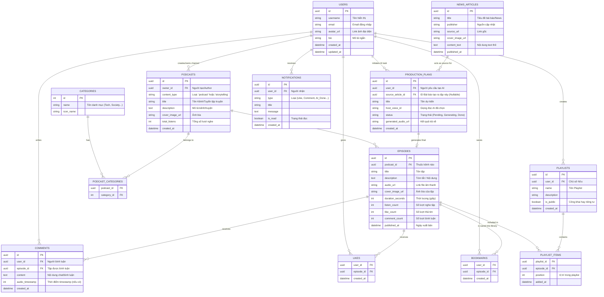

# Thiết Kế Cơ Sở Dữ Liệu Pody

Dựa trên việc phân tích các màn hình chức năng của ứng dụng (Home, Player, News, Create, Library, Detail, Comments, v.v.), dưới đây là thiết kế Cơ sở dữ liệu (Database Schema) toàn diện cho hệ thống Pody. CSDL được thiết kế theo hướng quan hệ (RDBMS) như PostgreSQL.

## 1. Sơ Đồ Thực Thể Kết Hợp (ERD)

## 2. Giải Text & Mô Hình Hóa Bảng

Dưới đây là mô tả chi tiết cho từng luồng dữ liệu chính của Pody:

### A. Quản lý Nội Dung (Core)
- **`USERS`:** Bảng quy tụ mọi tài khoản tham gia (nghe, tác giả podcast/truyện). 
- **`PODCASTS` (Shows/Series):** Đại diện cho một Kênh Podcast hoặc một Tuyển tập truyện kể (Audiobook/Storytelling). Biến `content_type` giúp phân dải UI thành 2 luồng: Podcast thời sự/chia sẻ và Kể chuyện/Audiobook.
- **`EPISODES`:** Từng phần riêng lẻ/từng tập được phát hành của kênh (hoặc từng chương truyện). Ghi nhận thời lượng, link file MP3, các chỉ số đếm ngược tương tác.

### B. Tương Tác Của Người Dùng (Social Metrics)
- **`LIKES` & `BOOKMARKS`:** Quản lý hành động Thả tim (nằm trong Player) và Lưu tập (Đưa vào Thư viện) của user. Bookmark list sẽ trích xuất ra mục "Saved" ở Library Screen.
- **`COMMENTS`:** Lưu trữ bình luận từ `comments_overlay.dart`. Điểm đặc sắc là có trường `audio_timestamp`, hỗ trợ tính năng comment đính kèm theo mốc thời gian của Podcast (SoundCloud style).
- **`PLAYLISTS` & `PLAYLIST_ITEMS`:** Hỗ trợ tính năng thiết lập thêm danh sách phát cá nhân hóa của user.

### C. Tính Năng AI Podcast (Đặc trưng Pody) 
Đây là điểm khác biệt của Pody - tính năng hô biến "News" thành "Podcast":
- **`NEWS_ARTICLES`:** Cào (Scrape) hoặc fetch qua API các bài báo thời sự mỗi ngày để show lên màn hình `news_screen.dart`.
- **`PRODUCTION_PLANS`:** Khi user bấm "Thêm vào playlist tạo AI", hệ thống sinh ra một Plan. Bảng lưu trữ tùy chỉnh (giọng đọc, chủ đề) và bắt đầu track tiến trình tạo AI (Status: Pending, Generating, Finished). Lịch sử của nó hiển thị ở tính năng Create / Edit Plan.
- Khi Plan hoàn tất, hệ thống có thể fill data để tạo bản ghi tự động sang bảng **`EPISODES`** đi kèm cờ nhận diện (is_ai_generated).

### D. Thông Báo
- **`NOTIFICATIONS`:** Hệ thống đẩy cho user qua app khi AI vừa sinh xong kịch bản/âm thanh, khi có ai đó Reply bình luận, hoặc channel theo dõi có tập mới.
