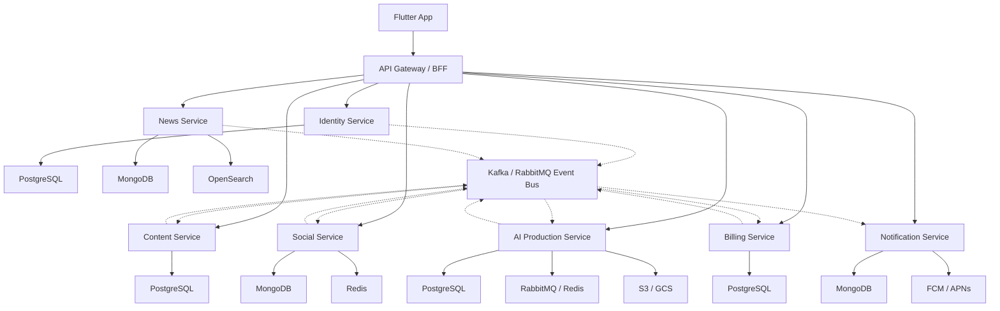

# Kiến Trúc Microservices Pody

## 1. Mục Tiêu Kiến Trúc

Pody được thiết kế theo hướng microservices để:

- scale độc lập theo tải thực tế của từng nghiệp vụ;
- tránh shared database;
- cho phép chọn đúng loại storage cho từng bài toán;
- giảm coupling giữa nội dung, social, AI, billing và notification.

## 2. Nguyên Tắc

1. Mỗi service có vòng đời deploy riêng.
2. Mỗi service sở hữu database riêng.
3. Không có join hay foreign key xuyên service.
4. Đồng bộ dữ liệu qua event bus và local read model.
5. File audio, ảnh, transcript luôn nằm ngoài DB, trong object storage.

## 3. Sơ Đồ Kiến Trúc

## 4. Trách Nhiệm Từng Service

| Service | Trách nhiệm chính | Storage |
| --- | --- | --- |
| Identity | user, auth, session, device | PostgreSQL |
| Content | show, episode, transcript, companion | PostgreSQL |
| Social | follow, reaction, comment, progress, playlist | MongoDB + Redis |
| News | crawl news, article store, search index | MongoDB + OpenSearch |
| AI Production | chat, plan, draft, generation job | PostgreSQL + Queue |
| Billing | subscription, payment, credit, entitlement | PostgreSQL |
| Notification | in-app notification, push log, settings | MongoDB |

## 5. Những Luồng Bất Đồng Bộ Quan Trọng

### Publish episode

1. Content Service publish episode.
2. Content phát `EpisodePublished`.
3. Notification tạo push cho follower.
4. Social cập nhật read model nếu cần.

### AI generate xong

1. AI worker tạo audio và upload object storage.
2. AI phát `EpisodeGenerationCompleted`.
3. Content tạo episode mới.
4. Notification gửi thông báo hoàn tất.

### User unlock premium

1. Billing debit credit hoặc activate entitlement.
2. Billing phát `EntitlementGranted`.
3. Content/BFF dùng entitlement để cho phép playback.

## 6. Query Composition

Các màn hình trong app sẽ không lấy mọi thứ từ một DB:

- `Home`: Content + Social counters + Billing entitlement.
- `Player`: Content episode + Social comments/reactions + Billing access check.
- `Profile`: Identity profile + Social follow stats + Content authored shows.
- `Create`: AI plans + News articles + Billing credit availability.

Query tổng hợp nên đi qua:

- API Gateway/BFF;
- hoặc read model riêng cho từng màn hình có traffic lớn.

## 7. Tài Liệu Liên Quan

- Thiết kế CSDL tổng thể: `database_schema.md`
- SQL cho service dùng PostgreSQL: `../server/sql/services/`
- Collection design cho service document store: `../server/schema/`
