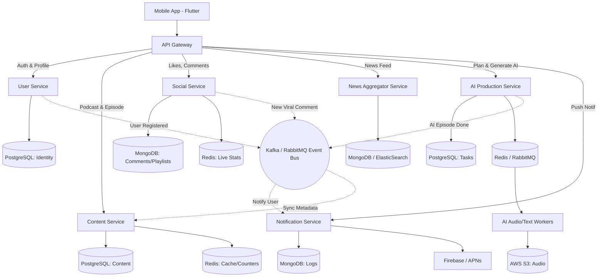

# Kiến Trúc Hệ Thống Pody (Microservices Architecture)

Thay vì một cơ sở dữ liệu nguyên khối (Monolithic Database) khổng lồ chứa mọi thứ, Pody được thiết kế theo kiến trúc **Microservices (Đa dịch vụ)**. Mỗi dịch vụ ranh giới (Domain) sẽ tự quản lý vòng đời và cơ sở dữ liệu riêng của nó (Database-per-service). Điều này giúp hệ thống chịu tải tốt (Scale independø
ent), không bị "chết chùm", và tối ưu hóa loại CSDL (SQL/NoSQL) cho đúng ngữ cảnh.

## 1. Sơ Đồ Kiến Trúc Tổng Thể

## 2. Phân Tích Các Service & Database

### 1. User Service (Dịch Vụ Căn Cước)
*   **Trách nhiệm:** Quản lý thông tin cá nhân, định danh, đăng nhập, bảo mật.
*   **Database:** **`PostgreSQL` (SQL)**. Vì dữ liệu user cần tính ràng buộc toàn vẹn và độ tin cậy giao dịch cực kỳ cao (ACID).
*   **Tables:** `Users`, `Roles`, `Auth_Sessions`.

### 2. Content Service (Dịch Vụ Nội Dung Lõi)
*   **Trách nhiệm:** Lưu trữ thông tin metadata của Kênh Podcast, các Tập, Danh mục. Phục vụ màn hình Home (Dành cho bạn), Search.
*   **Database chính:** **`PostgreSQL` (SQL)** (Mối quan hệ Podcast - Category - Episode rất chặt chẽ).
*   **Database phụ:** **`Redis`** để cache lại các Query nặng ở màn hình Home, và lưu đệm lượt đếm `Total Listens`.
*   **Tables:** `Podcasts`, `Episodes`, `Categories`.

### 3. Social Service (Dịch Vụ Tương Tác Xã Hội)
*   **Trách nhiệm:** Xử lý Lượt thả tim (Like), Thư viện (Bookmark/Saved), Playlist cá nhân, và đặc biệt là hệ thống Comments Overlay đính kèm timestamp.
*   **Database:** **`MongoDB` (NoSQL)**. 
*   **Lý do:** Comment theo dòng thời gian thường phát sinh cực nhanh với khối lượng khổng lồ và schema lỏng lẻo (có icon, có reply, có ảnh gif). Đẩy vào NoSQL sẽ giảm tải cực độ cho hệ thống thay vì khóa bảng liên tục ở SQL.

### 4. News Aggregator Service (Dịch Vụ Gom Báo)
*   **Trách nhiệm:** Định kỳ đi cào (Crawl/Fetch) bài viết từ các trang tin, RSS feed rồi đổ về màn hình `news_screen.dart`.
*   **Database:** **`MongoDB` hoặc `ElasticSearch`**.
*   **Lý do:** Nội dung text của báo chí khá phi cấu trúc (Unstructured data) và cần công cụ Text-Search cực mạnh để tìm theo keyword, ElasticSearch/Mongo sinh ra để làm việc này.

### 5. AI Production Service (Dịch Vụ Máy Xay AI)
*   **Trách nhiệm:** Đóng vai trò lò luyện đan. Nhận lệnh "Tạo Podcast" từ user, tạo Task (Production Plan), gọi qua LLM (OpenAI/Gemini) để summary text rồi qua Google/ElevenLabs TTS để gen Audio.
*   **Kiến trúc bên trong:** 
    *   **PostgreSQL:** Quản lý trạng thái lệnh yêu cầu (`Pending`, `Processing`, `Completed`).
    *   **Redis/RabbitMQ (Message Queue):** Hàng đợi chứa các jobs chờ gen audio (Việc này tốn rất nhiều thời gian, cần xử lý Background bằng Worker).
    *   **AWS S3 / GCS (Object Storage):** Lưu file MP3 và hình ảnh Cover kết quả.

### 6. Notification Service (Dịch Vụ Báo Tin)
*   **Trách nhiệm:** Lắng nghe các event nội bộ (Ví dụ AI báo "Em đã làm xong audio rồi sếp") sau đó đẩy Firebase Push Notification (FCM) xuống màn hình điện thoại của User.
*   **Database:** **`MongoDB`** (Chứa lịch sử thông báo đã gửi, đã đọc, thông báo rác).

## 3. Các Service Giao Tiếp Với Nhau Như Thế Nào?

Bởi vì các Service rải rác và Database tách biệt, chúng ta không thể viết mã `JOIN` giữa User và Podcast được nữa. Hệ thống Pody lúc này sẽ dùng **Kiến Trúc Dựa Trên Sự Kiện (Event-Driven Architecture)**, thông qua "Bưu điện trung tâm" là **Apache Kafka** hoặc **RabbitMQ**:

*   **Ví dụ 1 (Đồng bộ Lượt Nghe):** User bấm nghe 1 phút ở `Content Service`, hệ thống nhét lệnh `+1 lượt nghe` vào RabbitMQ. Ở đầu kia, `Social Service` bắt được sự kiện, tự âm thầm cộng số đếm vào Database của nó. User tắt app rồi server vẫn chạy ngầm mượt mà.
*   **Ví dụ 2 (Hoàn Thành AI):** Lò luyện `AI Production Service` ráp file MP3 xong, nó lưu vào S3, rồi bắn 1 sự kiện `AI_Audio_Ready` vào Kafka. Lúc này, 2 anh chàng nhảy vào nhận tin:
    *   Anh `Content Service` lấy link MP3 đó, chủ động tạo một Episode mới ở màn hình Home.
    *   Anh `Notification Service` nhận tin, lập tức rung màn hình tít tít báo user *"Podcast tổng hợp tin nóng chiều nay đã sẵn sàng!"*.
