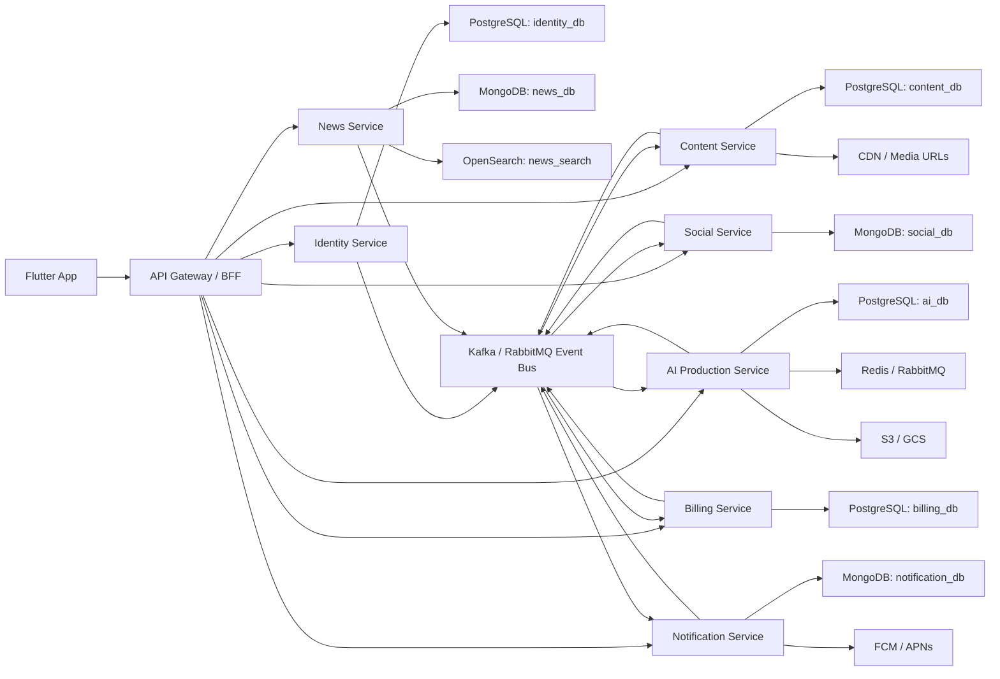

# Thiết Kế Cơ Sở Dữ Liệu Pody Theo Microservices

## 1. Mục Tiêu

Mục tiêu của Pody không phải là một schema lớn dùng chung cho toàn hệ thống, mà là:

- chia **microservices theo bounded context**;
- mỗi service **sở hữu dữ liệu riêng** (`database-per-service`);
- không dùng `JOIN` hoặc `FOREIGN KEY` xuyên service;
- giao tiếp giữa các service qua **API + event bus**;
- chấp nhận **eventual consistency** cho counter, feed, notification và read model.

## 2. Nguyên Tắc Thiết Kế

### 2.1 Không Có Shared Database

Mỗi service có database riêng và chỉ service đó được quyền ghi trực tiếp:

- Identity Service không ghi vào bảng của Content Service.
- Billing Service không cập nhật trực tiếp `episodes` hay `shows`.
- Social Service không dùng FK tới DB của Identity hoặc Content.

### 2.2 Cross-Service Reference Chỉ Là External ID

Ví dụ:

- `content.shows.owner_user_id` chỉ là `UUID` của user bên Identity Service.
- `billing.content_entitlements.episode_id` chỉ là `UUID` của episode bên Content Service.
- `ai.production_plans.target_show_id` chỉ là `UUID` của show bên Content Service.

Các cột này **không có FK** vì dữ liệu nằm ở DB khác.

### 2.3 Không Join Xuyên Service

Khi client cần màn hình tổng hợp:

- API Gateway/BFF sẽ gọi nhiều service;
- hoặc service sẽ giữ **snapshot/read model** cục bộ;
- hoặc dùng projection/event subscriber để dựng view đọc riêng.

### 2.4 Mọi Service Đều Cần Inbox/Outbox

Để publish/consume event an toàn:

- service dùng SQL nên có `outbox_events` và `inbox_processed_events`;
- service dùng Mongo cũng nên có collection tương đương;
- consumer phải idempotent theo `event_id`.

## 3. Sơ Đồ Tổng Quan

## 4. Bản Đồ Service -> Database

| Service | Storage chính | Sở hữu dữ liệu | File thiết kế |
| --- | --- | --- | --- |
| Identity Service | PostgreSQL | user, auth, device, session | `../server/sql/services/identity_service.sql` |
| Content Service | PostgreSQL | show, host, episode, transcript, companion | `../server/sql/services/content_service.sql` |
| Social Service | MongoDB + Redis | follow, playlist, bookmark, progress, comment, reaction | `../server/schema/social_service.md` |
| News Service | MongoDB + OpenSearch | nguồn tin, bài báo, crawl job, search index | `../server/schema/news_service.md` |
| AI Production Service | PostgreSQL + Queue | chat, plan, draft, generation job, voice profile | `../server/sql/services/ai_service.sql` |
| Billing Service | PostgreSQL | subscription, payment, credit ledger, entitlement | `../server/sql/services/billing_service.sql` |
| Notification Service | MongoDB | notification, delivery log, user settings | `../server/schema/notification_service.md` |

## 5. Ranh Giới Sở Hữu Dữ Liệu

### 5.1 Identity Service

Sở hữu:

- hồ sơ user;
- liên kết đăng nhập Google/Apple/email;
- session refresh token;
- device token cho push.

Không sở hữu:

- follower count;
- danh sách podcast theo dõi;
- subscription;
- comment;
- playlist.

Các số đếm như `follower_count`, `show_count` nếu cần hiện ngay trên profile nên là:

- read model cache;
- hoặc snapshot được đồng bộ bằng event.

### 5.2 Content Service

Sở hữu:

- show/podcast;
- host của show;
- episode;
- transcript segment;
- companion blocks trong player;
- category, tag nội dung.

Không sở hữu:

- like thật của user;
- comment thật của user;
- follow show;
- credit balance;
- user profile gốc.

Content chỉ nên giữ:

- `owner_user_id`;
- snapshot tên/avatar nếu cần render nhanh;
- counter như `like_count`, `comment_count`, `subscriber_count` ở mức eventual consistency.

### 5.3 Social Service

Sở hữu:

- follow user;
- follow show;
- saved episode;
- playlist;
- listening progress;
- episode reaction;
- comments.

Social là nơi tốt nhất để lưu các entity có write volume cao và thay đổi liên tục theo người dùng.

### 5.4 News Service

Sở hữu:

- news source;
- article ingest;
- article text;
- search index;
- crawl/import job.

AI Service không nên đọc thẳng DB của News Service, mà dùng:

- API lấy article;
- hoặc event `NewsArticlePublished`;
- hoặc snapshot article được copy vào `production_plan_sources`.

### 5.5 AI Production Service

Sở hữu:

- chat thread với AI;
- production plan;
- host/persona trong plan;
- episode draft;
- generation job;
- voice profile dùng cho TTS.

Không sở hữu:

- episode cuối cùng đang public trên app;
- show metadata cuối cùng;
- credit ledger thật;
- article gốc.

AI chỉ giữ reference/snapshot cần thiết để tái hiện plan.

### 5.6 Billing Service

Sở hữu:

- subscription plan;
- user subscription;
- payment transaction;
- credit ledger;
- credit reservation;
- entitlement truy cập premium.

Billing không nên cập nhật trực tiếp show/episode sau khi user unlock. Thay vào đó:

- Billing phát event `EntitlementGranted`;
- Content/Social/BFF dùng event hoặc API để quyết định quyền truy cập.

### 5.7 Notification Service

Sở hữu:

- notification in-app;
- delivery log;
- preference nhận thông báo;
- template/rendering metadata nếu cần.

Notification chỉ dùng `user_id`, `actor_user_id`, `target_id` như external reference.

## 6. Thiết Kế Theo Từng Service

### 6.1 Identity Service

**Storage:** PostgreSQL  
**Schema file:** `../server/sql/services/identity_service.sql`

**Bảng chính**

- `users`
- `user_identities`
- `user_devices`
- `auth_sessions`
- `outbox_events`
- `inbox_processed_events`

**Event phát ra**

- `UserRegistered`
- `UserProfileUpdated`
- `UserSuspended`
- `UserDeviceUpserted`

### 6.2 Content Service

**Storage:** PostgreSQL  
**Schema file:** `../server/sql/services/content_service.sql`

**Bảng chính**

- `categories`
- `tags`
- `shows`
- `show_categories`
- `show_tags`
- `show_hosts`
- `episodes`
- `episode_tags`
- `episode_assets`
- `episode_segments`
- `episode_companion_blocks`
- `outbox_events`
- `inbox_processed_events`

**Event phát ra**

- `ShowPublished`
- `ShowArchived`
- `EpisodePublished`
- `EpisodeUpdated`

**Event consume**

- `UserProfileUpdated`
- `EpisodeGenerationCompleted`
- `EntitlementGranted` nếu cần cập nhật read model hiển thị premium

### 6.3 Social Service

**Storage:** MongoDB + Redis  
**Schema file:** `../server/schema/social_service.md`

**Collection chính**

- `user_follows`
- `show_follows`
- `saved_episodes`
- `playlists`
- `playlist_items`
- `listening_progress`
- `episode_reactions`
- `comments`
- `episode_engagement_counters`
- `outbox_events`
- `inbox_processed_events`

**Event phát ra**

- `UserFollowed`
- `ShowFollowed`
- `EpisodeLiked`
- `CommentCreated`
- `CommentDeleted`
- `ListeningProgressUpdated`

### 6.4 News Service

**Storage:** MongoDB + OpenSearch  
**Schema file:** `../server/schema/news_service.md`

**Collection/index chính**

- `sources`
- `crawl_jobs`
- `articles`
- `article_embeddings` hoặc `article_chunks` nếu làm semantic retrieval
- `outbox_events`
- `inbox_processed_events`
- OpenSearch index `news_articles_search`

**Event phát ra**

- `NewsArticlePublished`
- `NewsArticleArchived`

### 6.5 AI Production Service

**Storage:** PostgreSQL + Queue + Object Storage  
**Schema file:** `../server/sql/services/ai_service.sql`

**Bảng chính**

- `voice_profiles`
- `chat_threads`
- `chat_messages`
- `chat_attachments`
- `production_plans`
- `production_plan_tags`
- `production_plan_hosts`
- `production_plan_sources`
- `production_plan_episode_drafts`
- `generation_jobs`
- `outbox_events`
- `inbox_processed_events`

**Event phát ra**

- `ProductionPlanCreated`
- `ProductionPlanCompleted`
- `EpisodeGenerationQueued`
- `EpisodeGenerationCompleted`
- `EpisodeGenerationFailed`

### 6.6 Billing Service

**Storage:** PostgreSQL  
**Schema file:** `../server/sql/services/billing_service.sql`

**Bảng chính**

- `subscription_plans`
- `user_subscriptions`
- `payment_transactions`
- `credit_ledger`
- `credit_reservations`
- `content_entitlements`
- `outbox_events`
- `inbox_processed_events`

**Event phát ra**

- `SubscriptionActivated`
- `SubscriptionExpired`
- `CreditsGranted`
- `CreditsDebited`
- `EntitlementGranted`

### 6.7 Notification Service

**Storage:** MongoDB  
**Schema file:** `../server/schema/notification_service.md`

**Collection chính**

- `user_notification_settings`
- `notifications`
- `delivery_logs`
- `templates`
- `outbox_events`
- `inbox_processed_events`

**Event consume**

- `EpisodePublished`
- `CommentCreated`
- `UserFollowed`
- `EpisodeGenerationCompleted`
- `SubscriptionActivated`

## 7. Cross-Service Contract Quan Trọng

### 7.1 Khi AI tạo xong episode

1. AI Service hoàn tất audio, upload S3/GCS.
2. AI Service ghi `outbox_events` với `EpisodeGenerationCompleted`.
3. Content Service consume event, tạo `episode` mới trong DB của mình.
4. Notification Service consume event và tạo notification "Podcast đã sẵn sàng".

### 7.2 Khi user unlock episode premium bằng credit

1. Client gọi Billing Service để debit credit.
2. Billing ghi `credit_ledger`, `content_entitlements`.
3. Billing phát `EntitlementGranted`.
4. BFF hoặc Content Service kiểm tra entitlement qua API/read model khi user mở episode.

### 7.3 Khi user đổi avatar/tên

1. Identity Service cập nhật `users`.
2. Identity phát `UserProfileUpdated`.
3. Content/Social/Notification cập nhật snapshot cục bộ nếu đang lưu denormalized data.

## 8. Những Quy Tắc Bắt Buộc Khi Tách Microservices

1. Không tạo `FOREIGN KEY` tới bảng ở service khác.
2. Không query trực tiếp DB của service khác.
3. Counter như `like_count`, `comment_count`, `subscriber_count` chỉ là projection, không phải source of truth.
4. Dữ liệu UI cần render nhanh nên giữ snapshot cục bộ: `display_name`, `avatar_url`, `show_title`, `episode_title`.
5. Mọi event phải có `event_id`, `aggregate_id`, `occurred_at`, `payload_version`.
6. Consumer phải idempotent.
7. File media luôn nằm ở object storage, DB chỉ giữ metadata và URL/storage key.

## 9. Kết Luận

Nếu mục tiêu là microservices, thiết kế đúng không phải "một schema lớn chia schema con", mà là:

- **một service = một database riêng**;
- mỗi database chỉ chứa thực thể service đó sở hữu;
- mọi quan hệ xuyên service đi qua **external id + event/API**;
- những gì cần "join" cho UI phải giải bằng **BFF, read model hoặc snapshot**.

Thiết kế chi tiết từng service đã được tách ra trong thư mục `server/sql/services/` và `server/schema/`.
