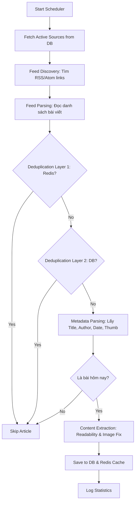

# 🗞️ TahaNews - Crawl Service

Crawl Service là một microservice mạnh mẽ được thiết kế để tự động thu thập tin tức từ các nguồn báo điện tử thông qua RSS Feed. Hệ thống được tối ưu hóa cho hiệu suất cao, lọc nội dung thông minh và đảm bảo không trùng lặp dữ liệu.

## 🚀 Tính năng nổi bật

- **Kiến trúc Module hóa**: Code được chia nhỏ thành các module chuyên biệt (Discovery, Extractor, Metadata, Storage) dễ bảo trì và mở rộng.
- **Chiến thuật Dual-Semaphore**: Tối ưu hóa hiệu suất bằng cách tách biệt luồng kiểm tra trùng lặp nhanh (40 luồng) và luồng tải nội dung nặng (20 luồng).
- **Lọc tin tức theo ngày**: Chỉ thu thập những bài báo được xuất bản trong **ngày hôm nay**, giúp dữ liệu luôn tươi mới.
- **Tính toán Content thông minh**:
  - Tự giải mã ảnh lazy-load (VnExpress, Tuổi Trẻ,...).
  - Sử dụng thư viện Readability để loại bỏ menu, quảng cáo, sidebar rác.
- **Deduplication 2 lớp**: Kết hợp Redis Cache (tốc độ cao) và PostgreSQL (tin cậy) để ngăn chặn bài viết trùng lặp.
- **Tự động hóa**: Cơ chế lập lịch linh hoạt (Scheduler) chạy ngầm 24/7.

## 🛠️ Luồng hoạt động (Workflow)



## 📋 Yêu cầu hệ thống

- Python 3.10+
- PostgreSQL
- Redis Server

## ⚙️ Cài đặt

1. **Cài đặt thư viện**:
   ```bash
   pip install -r requirements.txt
   ```

2. **Cấu hình môi trường**:
   Tạo file `.env` từ `.env.example` và điều chỉnh các thông số:
   ```env
   DB_HOST=localhost
   DB_PORT=5432
   DB_NAME=tahanews
   DB_USER=postgres
   DB_PASSWORD=your_password

   REDIS_HOST=localhost
   REDIS_PORT=6379

   CRAWLER_INTERVAL_MINUTES=30
   MAX_CONCURRENT_REQUESTS=10
   ```

## 🏃 Cách chạy

### Chạy chính thức (Production)
```bash
python main.py
```

### Chạy Debug/Test
- `debug_content.py`: Kiểm tra thử thuật toán trích xuất nội dung từ một URL bài báo cụ thể.
- `setup_test.py`: Thiết lập dữ liệu mẫu để chạy thử nghiệm.

## 📁 Cấu trúc thư mục

- `main.py`: Entry point, quản lý vòng đời ứng dụng và bộ lập lịch.
- `config/`: Chứa các quản lý kết nối Database và Redis.
- `services/crawler/`: Chứa logic lõi:
  - `discovery.py`: Tìm kiếm RSS links.
  - `extractor.py`: Trích xuất và làm sạch nội dung HTML.
  - `metadata.py`: Bóc tách thông tin tác giả, ngày tháng, ảnh đại diện.
  - `storage.py`: Xử lý lưu trữ và kiểm tra trùng lặp.
  - `engine.py`: Điều phối toàn bộ quy trình.
- `repositories/`: Tương tác trực tiếp với cơ sở dữ liệu.

---
© 2026 TahaNews Team.
